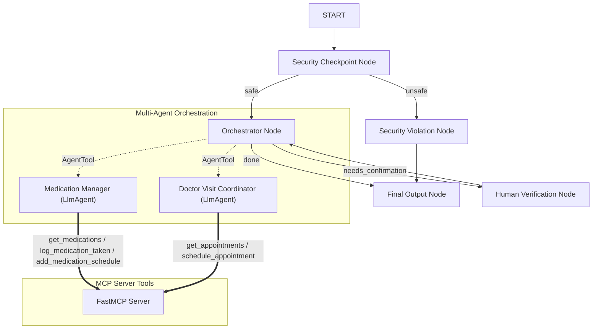

# ADK Submission Write-up — Elder Care Assistant

## Problem Statement
Elderly individuals and their caregivers face significant cognitive and administrative burdens in tracking complex medication schedules and coordinating frequent doctor visits. Traditional apps are often too complicated or lack natural, friendly conversational interfaces. Moreover, handling sensitive health details introduces severe security and privacy risks. The **Elder Care Assistant** solves this by providing a reassuring, easy-to-use voice/chat interface that automates schedules and appointment bookings securely.

## Solution Architecture

## Concepts Used

This project implements all core ADK 2.0 and platform integration concepts:
1. **ADK Workflow**: Sourced in [agent.py](file:///c:/Users/Asus/OneDrive/Documents/AI-Agents/adk-workspace/elder-care-assistant/app/agent.py#L173-L188). It defines a structured graph with 5 custom nodes and conditional/looping edges.
2. **LlmAgent**: Configured for specialized roles (Orchestrator, Medication Manager, Doctor Visit Coordinator) with custom instructions in [agent.py](file:///c:/Users/Asus/OneDrive/Documents/AI-Agents/adk-workspace/elder-care-assistant/app/agent.py#L42-L99).
3. **AgentTool**: Sourced in [agent.py](file:///c:/Users/Asus/OneDrive/Documents/AI-Agents/adk-workspace/elder-care-assistant/app/agent.py#L96). Used by the Orchestrator to delegate task execution dynamically while staying in control.
4. **MCP Server**: Implemented in [mcp_server.py](file:///c:/Users/Asus/OneDrive/Documents/AI-Agents/adk-workspace/elder-care-assistant/app/mcp_server.py). Exposes SQLite-backed tools using standard stdio transport.
5. **Security Checkpoint**: Implemented as the `security_checkpoint` node in [agent.py](file:///c:/Users/Asus/OneDrive/Documents/AI-Agents/adk-workspace/elder-care-assistant/app/agent.py#L101-L136).
6. **Agents CLI**: Project scaffolded using `agents-cli scaffold create` and configured with default `.env` files.

## Security Design

The security node provides three key safety layers:
- **PII Scrubbing**: Active regex matching for Social Security Numbers and phone numbers. This prevents private health identifiers from being sent to external LLMs.
- **Prompt Injection Prevention**: Rejects malicious prompts attempting to hijack the agent (e.g. "ignore previous instructions").
- **Domain-Specific Rule (Consent check)**: Detects requests to share medical information with third parties (like insurance) without explicit consent, blocking unsafe disclosures.
- **JSON Audit Logs**: Emits structured severity logs (`INFO`, `WARNING`, `CRITICAL`) for every query validation to monitor agent safety.

## MCP Server Design

The FastMCP server exposes 5 key tools matching the application's domain needs:
- `get_medications`: Reads current schedule and dosage from SQLite.
- `log_medication_taken`: Logs when a user takes a specific medication.
- `add_medication_schedule`: Writes a new medication schedule to database.
- `get_appointments`: Retrieves all future doctor visits.
- `schedule_appointment`: Saves doctor booking details to database.

## Human-in-the-Loop (HITL) Flow

To prevent the AI from scheduling incorrect doctor appointments without confirmation, the system implements a strict Human-in-the-Loop (HITL) verification step:
1. When the `visit_coordinator` sub-agent detects a booking intent, it sets `needs_confirmation=True`.
2. The orchestrator propagates this, routing the graph to the `human_verification_node`.
3. The workflow yields `RequestInput`, halting execution and asking the user for confirmation.
4. Once the user responds, the workflow resumes, routing back to the orchestrator to finalize database updates or cancel the operation.

## Demo Walkthrough

- **Scenario 1: Read schedule**: User asks for active meds. Orchestrator calls medication manager, reads from SQLite, and displays Lisinopril/Metformin/Atorvastatin.
- **Scenario 2: Book appointment**: User requests booking. Agent pauses, asks for confirmation, user replies "yes", and appointment is successfully written to SQLite.
- **Scenario 3: Injection check**: User enters an injection payload. Security checkpoint blocks it instantly, routing to violation output.

## Impact & Value Statement

The Elder Care Assistant empowers elderly individuals to live more independently by removing the friction of scheduling and tracking. Caregivers gain peace of mind knowing schedules are logged automatically. By integrating security checkpoints and human approval gates, it delivers a secure, production-ready healthcare companion.
